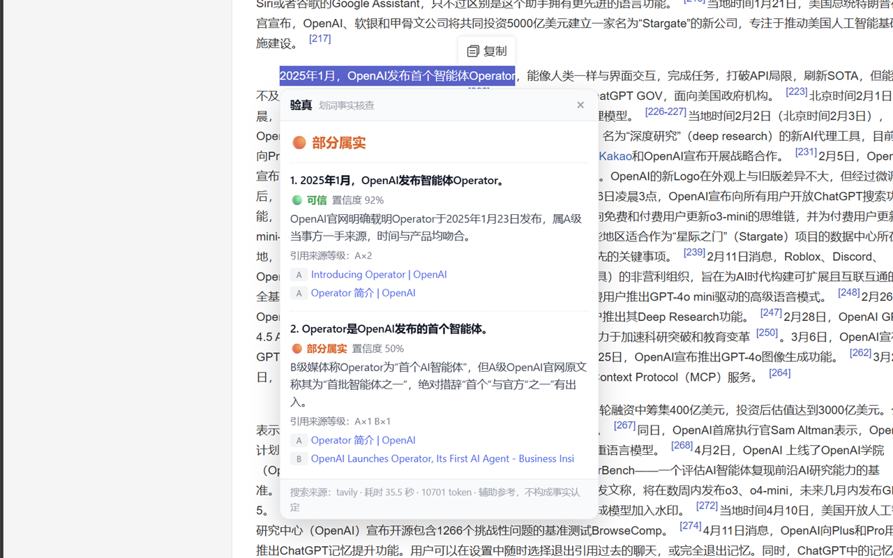

# 验真 · YanZhen

> 选中一段文字，按个快捷键，告诉你这段话**能不能信**——以及**凭什么**。

一个划词事实核查工具。在网页上划一段字 → 按 `Ctrl+Shift+X` → 弹出结论和证据来源。



<sub>↑ 真实使用截图：在百度百科上划一段话，卡片直接给出判定、逐条断言的置信度和来源等级</sub>

---

## ⚠️ 项目状态：v0.1.0（早期版本，功能不完整）

**这是刚起步的版本，请当作"能跑的实验品"而不是成熟软件。**

**已经能用的：**

- ✅ 划词 + 快捷键调出浮动卡片（Edge / Chrome 扩展）
- ✅ 断句级核查：一段话拆成若干断言，逐条判定 + 附来源链接
- ✅ 来源分级（官方一手 / 当事方官网 / 权威媒体 / 专业机构 / 自媒体）
- ✅ 中英双语检索、涉及近期事件时自动搜新闻
- ✅ 命令行版（用于调试和跑评测）
- ✅ 一套 19 条的评测集 + 评测脚本（**评测过程和踩过的坑都写在 `eval/NOTES.md` 里**）

**还没做的：**

- ⬜ 历史记录（查过的东西留档）
- ⬜ 溯源反查（这段文字最早出现在哪、什么时候 —— 治「旧闻新炒」）
- ⬜ 截图核查（图片里的文字）
- ⬜ 界面打磨
- ⬜ 更多中文搜索源（博查适配器写了但**未实测**）
- ⬜ **上架浏览器商店**（物料已备齐，就差提交，见 [`store/SUBMIT.md`](store/SUBMIT.md)）

**已知问题**（详见下方「已知限制」和 `eval/NOTES.md`）：

- 冷启动时同一段文字可能给出不同结论（缓存期内一致）
- 「尚无定论」类的判定还不够稳 —— 评测里 4 条只对 1 条，**但其中几条可能是我标注的 ground truth 有问题**
- 只能在浏览器里划词，管不到微信、Word、PDF

**更新节奏**：以 v0.x 小版本逐步补齐上面这些，改动都记在 [`CHANGELOG.md`](CHANGELOG.md)。

---

## 现在有两种形态

| 形态 | 位置 | 说明 |
|---|---|---|
| **Edge / Chrome 扩展** ⭐ | `extension/` | 划词 + 快捷键 + 浮动卡片。**装法见 [`extension/README.md`](extension/README.md)，3 分钟** |
| **命令行原型** | 根目录 | 验逻辑、跑评测用。`python yanzhen.py "要核查的文字"` |

两边是**同一套逻辑的两种实现**（Python 版 + JS 版）：命令行版当实验田，先在这里试新规则、
用 `eval/` 量化效果；验证过再同步到扩展版。两边的判定规则完全一致。

> JS 版不是"重写一遍就完事"——它已经用同一段测试文字和 Python 版对过答案，结论一致。

---

## 它和搜索引擎有什么不同

搜索引擎给你一堆链接，让你自己判断。这个工具给你：

1. **一句结论** —— 🟢 可信 / 🟡 证据不足 / 🔴 与事实不符
2. **拆开来看** —— 一段话里通常混着好几条断言，每条单独判
3. **凭什么** —— 每条判定的依据来源，点得开
4. **不猜** —— 查不到就直说"证据不足"，这是本工具的核心态度

---

## 工作原理

**大模型自己不知道真假，它只会编。** 所以这个工具绝不让模型凭记忆下结论，而是：

```
你选中的文字
   ↓
① DeepSeek：拆成若干条「可核查的断言」，同时给出中文关键词、
   英文关键词，以及这条是否涉及近期事件
   ↓
② 搜索 API：每条断言最多搜四次
     · 中文关键词
     · 英文关键词  ← 科普/健康/科学类内容，英文资料质量明显更好
     · 辟谣路：关键词 +「辟谣 真相」/「fact check」
       ← 直接去找有没有人已经核查过这句话，而不是又搜回谣言本身
       ← 这一路**只在国内辟谣平台里搜**（piyao.org.cn、科普中国辟谣…）：
          Tavily 的域名限定是硬过滤，用在这里刚好；用错了会让整路空手而归
     · 新闻模式（仅当涉及近期事件）：只取最近 N 天的新闻，带发布时间
   结果合并去重，按来源等级排序，只留最强的 6 条（控制成本）
   （内容农场/门户转载在检索时就排除了 —— 位子固定，垃圾占一个就少一个权威）
   ↓
②.5 全文抓取：搜索只给一小段摘要，关键限定词（"但孕妇禁用"这类）
    常常不在摘要里。所以对**够格下结论的来源**（默认 A/B 级）
    再抓一次网页正文，每条断言最多 3 页、每页留 3000 字
   ↓
③ DeepSeek：只依据证据下判定，查不到就说查不到。
   每条证据都会标明这条看的是「全文」还是「仅摘要」——
   只看到摘要时，模型不会因为"摘要里没提例外"就下太强的结论。
   还有一条反过来的护栏（实测加上的）：**证据更长 ≠ 可以下更强的结论**。
   全文里出现支持性表述，不构成放宽「部分属实」门槛的理由
```

模型是被"绑住手"的，一共三道闸门：

1. **提示词层面** —— 明令禁止它使用自己的记忆或常识补充事实，禁止编造网址。
2. **来源分级** —— 每条检索结果都会被自动打上等级，并写进提示词：

   | 等级 | 含义 | 能不能支撑判定 |
   |---|---|---|
   | **A** 官方一手 | 政府、公立机构、原始文件、国际组织（WHO/欧盟/NASA…） | ✅ 可以 |
   | **A** 当事方官网 | 机构/企业自己的网站（openai.com、microsoft.com…） | ⚠️ **只能证明"关于该机构自身的事实"**，不能证明"效果更好/更安全" |
   | **B** 权威媒体 | 央媒、国际主流媒体、知名科普媒体 | ✅ 可以 |
   | **C** 专业机构 | 科普机构、医院、高校、学术库、标准组织 | ⚠️ 单独不够，置信度上限 0.6 |
   | **D** 自媒体百科 | 微博、公众号、知乎、百科、门户转载 | ❌ 只能当线索 |
   | **未分级** | 域名认不出来路 | ⚠️ 2 条以上相互独立且结论一致时可用，置信度上限 0.6 |

   规则写死：**只有 A / A当事方 / B 级来源才能支撑「可信 / 与事实不符」的判定**。
   名单覆盖**中文 + 国际**来源（各国政府后缀、BBC/路透/美联社、各国主流媒体、国际事实核查机构）。

3. **引用校验（硬闸门）** —— 模型给出的每个网址，都会拿去和检索结果逐一比对。
   **不在检索结果里的一律剔除，并在界面上报警。** 模型编造引用在这里过不去。

**需要两个 key**：
| 用途 | 服务 | 申请地址 | 费用 |
|---|---|---|---|
| 模型 | DeepSeek | https://platform.deepseek.com/ | 按 token 计费 |
| 搜索 | **Tavily** | **https://app.tavily.com** | **每月 1000 次免费，不用信用卡** |
| 搜索（可选，国内） | 博查 | https://open.bochaai.com | 未验证 |

> 搜索服务是**可替换**的。代码里做了一层适配器（`search.py`），用哪家由 `.env` 里的 `SEARCH_PROVIDER` 决定。想加一家新的，写个函数注册进去就行，其余代码不用动。

---

## 快速开始

**不需要 pip install 任何东西**，只用 Python 标准库。需要 Python 3.8+。

```bash
# 1. 复制配置模板
copy config.example.env .env      # Windows
# cp config.example.env .env      # macOS / Linux

# 2. 打开 .env，填入你的两个 key

# 3. 先跑一次模拟搜索，确认程序能跑（不联网检索、不花搜索额度）
python yanzhen.py --mock "隔夜水会致癌，因为反复烧开会产生大量亚硝酸盐"

# 4. 换成真实搜索
python yanzhen.py "隔夜水会致癌，因为反复烧开会产生大量亚硝酸盐"
```

其他用法：

```bash
python yanzhen.py                    # 交互式：粘贴多行文字，单独一行输入 END 结束
python yanzhen.py -f samples.txt     # 从文件读
python yanzhen.py --no-color "..."   # 关掉彩色
```

输出长这样：

```
────────────────────────────────────────────────────────
  结论：🔴 与事实不符（2 条断言中 1 条与事实不符）
────────────────────────────────────────────────────────

① 隔夜水会致癌，因为反复烧开会产生大量亚硝酸盐
   🔴 [与事实不符]   置信度 88%
   理由：亚硝酸盐含量远低于国家安全标准，无致癌证据
   来源：
     · 权威来源标题  https://...

② ...
```

---

## 成本

一次核查 ≈ **6~9 次检索 + 1~2 次全文抓取**（都在 Tavily 免费额度内）+ **2 次模型调用**，模型侧大概几分钱。

全文抓取（`FULLTEXT`）的额外开销：

| 配置 | 作用 | 默认 |
|---|---|---|
| `FULLTEXT` | `1` 抓正文 / `0` 只看搜索摘要 | `1` |
| `FULLTEXT_PROVIDER` | `auto`（有 key 走 Tavily）/ `tavily` / `http`（免费直抓）/ `off` | `auto` |
| `FULLTEXT_MAX` | 每条断言最多抓几页 | `3` |
| `FULLTEXT_CHARS` | 每页正文截断到多少字 | `3000` |
| `FULLTEXT_TIERS` | 只对哪些等级抓正文 | `A,B` |

实测（2026-10-08，单条断言）：开了全文后证据正文从 7086 字涨到 10396 字，
判定那一步多约 700 token —— 成本增幅很小，但模型能看到原文里的限定条件了。

想更省：把 `MAX_CLAIMS` 调小（默认 3，即一次最多核查 3 条断言），或把 `FULLTEXT` 设为 `0`。

> Tavily `/extract` 约 1 credit / 5 个网页，一次核查通常多花 1~2 credit。
> `FULLTEXT_PROVIDER=http` 是**完全免费**的直抓通道（自己拉网页剥 HTML 标签），
> 代价是 JS 渲染的站点抓不到、不支持 PDF、中文站点要注意 GBK 编码。
> 浏览器扩展版只走 Tavily —— 在浏览器里直抓任意网站要申请 `<all_urls>` 主机权限，
> 为了一个兜底通道把商店审核风险拉高不划算。

---

## 上手开发（第 1 步，还没做）

下一步是把这套逻辑包成浏览器扩展：

- 快捷键 → Chrome/Edge 扩展的 `commands` 字段声明，浏览器直接接管，**不用自己写全局热键**
- 取选中文字 → `window.getSelection()`
- 展示 → 侧边栏卡片

装的时候不需要上架商店：浏览器开开发者模式，加载本地文件夹即可。

> 已知边界：浏览器扩展**只能在自己的浏览器里划词**，管不到微信、PDF 阅读器、Word。要覆盖全系统得另做（AutoHotkey 或全局热键），麻烦得多，以后再说。

---

## 评测

「它到底准不准」这个问题的答案在这里，不在 README 的形容词里。

### 当前成绩（19 条样本，单次运行）

| 版本 | 准确率 | 改了什么 |
|---|---|---|
| v0.4.0 | 15/19 = 78.9% | 检索并行化 + 辟谣检索 |
| **v0.5.0（当前）** | **14/19 = 73.7%** | 加「权威冲突必须判 insufficient」规则 |

⚠️ **这两个数字的差在噪声以内，不等于"新规则让准确率变差了"。**

实测证据：v0.4.0 到 v0.5.0 之间，我**没有做任何针对 t04 的改动，t04 自己从"判成不符"
变成了"判成混合"** —— 也就是说**噪声下限至少 ±1 条**（19 条约 5%）。
而两个版本的总变化正好就是 1 条。

**所以「跑一次评测看分数涨了还是跌了」在这个项目上目前不成立。**
详细归因和"该怎么办"见 [`eval/NOTES.md`](eval/NOTES.md) 顶部。

分类看（以 v0.4.0 那次为准）：

| 类别 | 样本数 | 答对 | 说明 |
|---|---|---|---|
| **明确为假的消息** | 10 | **10** ✅ | 多个版本、多次评测，这一类从没掉过 |
| **明确为真的消息** | 5 | 4 | 1 条把"主属实、末句说过头"判成了"不符" |
| **尚无定论的话题** | 4 | 1 | 波动全在这一类；且其中几条的 ground truth 本身有争议 |

> **一处自我更正**：这里以前写过"**不是工具不稳定，是我这一类的标签没标好**"。
> 2026-10-04 的实测证明这话说了一半错话 —— 标签确实有问题，
> 但**工具本身也是不稳定的**（t04 在没有任何相关改动的情况下自己翻转）。
> 两个问题同时存在，别用其中一个掩盖另一个。

### 用真实材料实测的边界（2026-10-03）

- 「隔夜水千滚水致癌」→ 🔴 与事实不符（A/B 级来源，准确）
- 「微波炉致癌 + 营养流失 90%」→ 🔴（中英双语检索，B/C 级来源）
- 「育儿补贴 3600 元/年」→ 🟢 可信（自动触发新闻模式，返回带发布时间的官方报道）

### 怎么自己跑

```bash
python eval/run_eval.py --limit 5     # 先跑 5 条（省钱、验证脚本）
python eval/run_eval.py --only r01    # 只跑指定 id
python eval/run_eval.py --resume --redo r02 r07   # 改判后只重跑受影响的样本
python eval/run_eval.py --yes         # 跑全部 19 条
```

- 样本在 `eval/cases.json`：**10 条已知为假 / 5 条已知为真 / 4 条尚无定论**，每条都附权威依据网址
- 报告自动写到 `eval/RESULT.md`，含逐条结果、判错样本的完整证据链，方便复盘
- ⚠️ **看数字之前先读 `eval/NOTES.md`** —— 那里记录了改判、已知弱点，以及**一次因加新档位导致准确率下降的回归事故**（我从 89.5% 搞到 73.7%，又修回 78.9% 的全过程）


## 已知限制（实测数据，不是猜测）

### 1. 结论的可复现性 ⚠️

**曾经的问题**：同一段关于生育津贴的文字连跑 3 次，总判定在 **可信 / 混合 / 证据不足** 之间跳。

**根因（已完整定位）**：

```
拆断言的措辞每次略有不同（"不经单位" vs "不经过单位"）
      ↓
搜索关键词变了 → 缓存未命中
      ↓
搜到不同证据 → 结论翻转
```

**把模型温度降到 0 试过 —— 没用**，方差主要来自检索，不是模型。

**已修**（三层）：

1. **检索缓存** —— 同样的 query 复用同一批网页
2. **结果缓存** —— 整条核查结果按输入文字缓存 7 天。同一段文字重复查询**结果完全一致**，
   第 2 次起耗时 0.0 秒、零成本
3. **规则补强** —— 把"措辞绝对化但存在成文例外"明确列为 `mixed`，减少判定摆动

**修完实测**：固定同一份证据连判 3 次 → **3/3 完全一致**。

**残留问题**（说清楚，不藏）：

- 缓存过期后（7 天）或换台机器，**冷启动仍可能给出不同答案**
- 上面那个"3/3 一致"只测了 **1 个样本**，样本量小，不能当成普遍保证
- 要更强的保证可以开多数投票：`.env` 里 `JUDGE_VOTES=3`（成本约翻 1.5 倍）

**所以：本工具是辅助参考，单次结论不等同于裁决。**

### 2. 评测集本身有弱点 ⚠️

`eval/NOTES.md` 里记录了有争议的样本、来源强度偏弱的样本，以及一次**改判记录**，
还有完整的稳定性实测过程。看准确率前请先读它。

**尤其要看最上面那条：现在的评测分辨不出 1 条样本的差别。**

实测证据：在**没有任何针对 t04 的改动**的情况下，t04 自己从"判错"变成了"判对" ——
**噪声下限至少 ±1 条**。这意味着"跑一次评测、看分数涨跌"的做法**在这个项目上目前不成立**。

**噪声出在「判定」这一步，不在检索。** 定位过程：先实现了拆断言缓存把断言和关键词固定下来，
然后用同一个 5 条子集连跑两次、核对缓存确认**输入完全相同** —— **结论还是翻了**。
所以 `temperature=0` 也不等于确定性输出。

（这条推翻了本文档早期的判断："措辞变 → 关键词变 → 证据变"。那个链条是真的，
但它不是全部。）

**要压住这个噪声只有两条路**：`JUDGE_VOTES=3`（**功能早就实现了，默认关闭**，代价是判定成本 ×3），
或者同一份代码跑多轮取平均。**在做其中一条之前，别拿单次分数下结论。**

### 3. 博查适配器未验证

`search.py` 里的博查接口是按公开文档写的，**我们还没有 key，没实测过**。

## 待办

- [x] 真实检索跑通（Tavily）
- [x] 来源分级（A/B/C/D）+ 判定门槛
- [x] 引用校验硬闸门（编造的网址会被剔除并报警）
- [x] 评测集 + 评测脚本
- [x] 检索缓存 + 结果缓存（解决"同一段文字两次两个答案"）
- [x] 中央口径 vs 地方做法的判定规则
- [x] 多数投票（`JUDGE_VOTES`，默认关闭，要紧的核查可开）
- [x] 浏览器扩展阶段 2.1（划词 + 快捷键 + 浮动卡片 + 结果缓存）
- [x] 双语检索（中文 + 英文各搜一遍）
- [x] 新闻模式（涉及近期事件时搜最近 30 天的新闻，带发布时间）
- [x] 来源名单扩展到国际（各国政府、BBC/路透/美联社、WHO、Snopes 等）
- [x] 修掉「未分级 = 弱证据」的逻辑错误
- [x] 应用图标（16/32/48/128）
- [x] 上架物料：隐私政策、商店文案、权限说明、打包脚本
- [ ] **提交到 Edge 加载项商店 / Chrome Web Store**（差截图 + 提交，见 `store/SUBMIT.md`）
- [ ] 扩展阶段 2.2：来源分级可视化打磨、历史记录
- [ ] 博查适配器实测
- [ ] 溯源反查：这段文字最早出现在什么时候、什么地方（治「旧闻新炒」）
- [ ] 截图核查（V4.1-Flash 支持图片输入）

---

## 准备上架

上架需要的材料和步骤都在 [`store/`](store/) 里：

| 文件 | 干什么的 |
|---|---|
| [`store/SUBMIT.md`](store/SUBMIT.md) | **从零到过审的完整步骤**，含常见被拒原因 |
| [`store/listing.md`](store/listing.md) | 商店文案（中英双语）+ 逐条权限说明 + 隐私问卷答案 |
| [`store/pack.py`](store/pack.py) | 打包脚本：`python store/pack.py`，自检不过就不出包 |
| [`store/test_core.mjs`](store/test_core.mjs) | **内核自测（推荐）**：`node store/test_core.mjs`。直接 import `core.js` 跑断言，验证分级 / 辟谣关键词 / 引用校验 / 判定优先级 + 四个 JS 文件的语法。不需要浏览器 |
| [`store/test_core.py`](store/test_core.py) | 同样这些检查，但借 **Edge 无头模式**执行——**没装 Node 时**的备选。缺点是写死了 Windows 下 Edge 的路径 |
| [`store/test_robust.py`](store/test_robust.py) | **健壮性回归测试**：`python store/test_robust.py`。用打桩验证「模型吐坏 JSON 时降级成无法判定而非崩掉」+ 拆断言缓存。**不联网、不花钱**，17 项全过 |
| [`store/check_secrets.py`](store/check_secrets.py) | **公开前自检**：拿 `.env` 里的真实密钥比对整个 git 历史，确认没泄露过 |
| [`store/gen_icons.py`](store/gen_icons.py) | 图标生成器（纯标准库，改几何参数即可换设计） |
| [`PRIVACY.md`](PRIVACY.md) | 隐私政策，上架时填这个文件的 GitHub 链接 |

> ⚠️ **上架只解决"装"，没解决"用"。** 用户仍需自备 DeepSeek + Tavily 两个 key，
> 这一层门槛比装扩展本身更高。详见 `store/SUBMIT.md` 结尾。

---

## 免责声明

本工具是**辅助参考**，不构成事实认定，也不能作为法律、医疗、投资的判断依据。
它的判定完全取决于检索到的证据和模型的推理，**可能出错**。重要事项请自行核实一手来源。

本项目只对**文字内容的可信度**给出参考意见，不对任何个人或机构作定性评价。

## 许可

MIT
